# Polyglot Codebase Knowledge Graph

> Generated offline by **readmenator**. Supports C, C++, Python, Go, Rust, JS/TS, Java, C#, Shell, PHP, Dart, GDScript, Nim, ASM, Ruby, Swift, Kotlin, Scala, Lua, Elixir.
> No LLMs. No tokens. Pure static analysis. See more [here](https://github.com/grisuno/ReadMenator)

**Total Files Parsed:** 2 | **Total Symbols Extracted:** 84 | **Total Imports:** 27

<!-- ranking_model: v1.0 | weights: {ppr:0.45,auth:0.2,test:0.15,doc:0.1,fresh:0.1} | alpha:0.85 | commit:f0ae16d | date:2026-07-18 -->


## Table of Contents

1. [Statistics Dashboard](#statistics-dashboard)
2. [Architectural Layers](#architectural-layers)
3. [Ranked Context](#ranked-context)
4. [God Nodes](#god-nodes)
5. [Suggested Questions](#suggested-questions)
6. [Hotspot Analysis](#hotspot-analysis)
7. [Change Impact Analysis](#change-impact-analysis)
8. [Suggested Linting Rules](#suggested-linting-rules)
9. [Orphans](#orphans)
10. [Query Recipes](#query-recipes)
11. [Structural Knowledge Map](#structural-knowledge-map)
12. [UML Class Diagram](#uml-class-diagram)
13. [Code Property Graph](#code-property-graph)
14. [Architecture Reference](#architecture-reference)
    - [PY (1 files)](#py-1-files)
    - [SH (1 files)](#sh-1-files)

---

## Statistics Dashboard

| Metric | Value |
|--------|-------|
| Total Files | 2 |
| Total Symbols | 84 |
| Total Imports | 27 |
| Call Edges | 1397 |
| Inheritance Edges | 10 |
| Languages | 2 |
| Avg Symbols/File | 42.0 |
| Avg Imports/File | 13.5 |

### Top Files by Import Count (Fan-Out)

| File | Imports | Symbols | Language |
|------|---------|---------|----------|
| `app.py` | 27 | 84 | py |

---

## Architectural Layers

Auto-detected from path patterns, naming conventions, and imported frameworks.

| Layer | Files |
|-------|-------|
| utility | 2 |

### utility

- `app.py` (py, 84 symbols)
- `install.sh` (sh, 0 symbols)

---

## Ranked Context

Files ranked by composite score for the current query context. The ranking combines Personalized PageRank (query relevance), global authority, test coverage, documentation coverage, and code freshness. Model: v1.0.

| Rank | File | Composite | PPR | Authority | Test | Doc |
|------|------|-----------|-----|-----------|------|-----|
| 1 | `app.py` | 0.0286 | 0.0000 | 0.0000 | 0.00 | 0.29 |
| 2 | `install.sh` | 0.0000 | 0.0000 | 0.0000 | 0.00 | 0.00 |

---

## God Nodes

Most architecturally central files ranked by combined import/export degree and symbol richness.

| File | Score | Connections | PageRank |
|------|-------|-------------|----------|
| `app.py` | 8.4 | | 0.0000 |
| `install.sh` | 0.0 | | 0.0000 |

---

## Suggested Questions

Auto-generated exploration prompts based on graph structure:

- What does app.py depend on, and what depends on it? (0 connections)
- What does install.sh depend on, and what depends on it? (0 connections)
- What is Config in app.py and how is it used?
- What is the overall architecture of this codebase?

---

## Hotspot Analysis

Files ranked by combined complexity (symbol count) and centrality (connection count). High-scoring files are architecturally critical and may need refactoring attention.

| File | Complexity | Centrality | Combined | Symbols | Connections |
|------|-----------|------------|----------|---------|-------------|
| `app.py` | 1.000 | 1.000 | 1.000 | 84 | 27 |
| `install.sh` | 0.000 | 0.000 | 0.000 | 0 | 0 |

---

## Change Impact Analysis

Files sorted by how many other files would be affected if they changed. High-impact files should be changed with caution.

| File | Direct Dependents | Transitive Dependents | Total Impact |
|------|------------------|----------------------|--------------|
| `app.py` | 0 | 0 | 0 |
| `install.sh` | 0 | 0 | 0 |

---

## Suggested Linting Rules

Automatically suggested linting and security rules based on patterns detected in the codebase. These can be exported as Semgrep rules using the `--export-rules` flag.

| Rule ID | Severity | Description | Language | Matches |
|---------|----------|-------------|----------|---------|
| `RM002` | warning | Bare except clause catches all exceptions including SystemExit | python | 3 |
| `RM001` | info | Large number of functions in py: 69 total | py | 69 |
| `RM003` | info | Print statement found (consider logging instead) | python | 109 |

---

## Orphans

Files with no documentation or low connectivity. These are candidates for documentation investment or cleanup.

- `install.sh` (0 symbols, no doc)

---

## Query Recipes

Example queries you can run against this knowledge base using the ranking engine:

```
# Find files most relevant to a concept
readmenator query "Where is the import resolver implemented?"

# Rank files by relevance to a topic
readmenator query "How does documentation generation work?"

# Explain why a file ranks highly
readmenator query "explain readmenator/_documentation.py"

# Trace dependency paths with ranked context
readmenator query "path from CLI to exporter"
```

The ranking model uses the following signals:

- **Personalized PageRank** (45% weight): query-specific relevance via seed propagation
- **Global Authority** (20% weight): structural importance via standard PageRank
- **Test Coverage** (15% weight): fraction of symbols referenced in test files
- **Doc Coverage** (10% weight): presence of docstrings and file-level docs
- **Freshness** (10% weight): recent modification activity

Results include score decomposition and justification paths for each ranked item.

---

## Structural Knowledge Map

```mermaid
graph TD
    classDef mod fill:#1e1e1e,stroke:#ff6666,stroke-width:2px,color:#fff;
    classDef cls fill:#2d2d2d,stroke:#4ec9b0,stroke-width:2px,color:#fff;
    classDef fn fill:#333,stroke:#dcdcaa,stroke-width:1px,color:#dcdcaa;
    classDef ext fill:#111,stroke:#666,stroke-dasharray: 5 5,color:#aaa;
    app_py["app.py (py)"]
    class app_py mod;
    app_py_Config["Config"]
    class app_py_Config cls;
    app_py --> app_py_Config
    app_py_seed_everything["seed_everything"]
    class app_py_seed_everything fn;
    app_py --> app_py_seed_everything
    app_py_ResourceMonitor["ResourceMonitor"]
    class app_py_ResourceMonitor cls;
    app_py --> app_py_ResourceMonitor
    app_py_PrefrontalOrchestrator["PrefrontalOrchestrator"]
    class app_py_PrefrontalOrchestrator cls;
    app_py --> app_py_PrefrontalOrchestrator
    app_py_TopologyMetrics["TopologyMetrics"]
    class app_py_TopologyMetrics cls;
    app_py --> app_py_TopologyMetrics
    install_sh["install.sh (sh)"]
    class install_sh mod;
    ext_torch["torch"]
    class ext_torch ext;
    app_py -.->|imports| ext_torch
    ext_torch_nn["torch.nn"]
    class ext_torch_nn ext;
    app_py -.->|imports| ext_torch_nn
    ext_torch_nn_functional["torch.nn.functional"]
    class ext_torch_nn_functional ext;
    app_py -.->|imports| ext_torch_nn_functional
    ext_torch_optim["torch.optim"]
    class ext_torch_optim ext;
    app_py -.->|imports| ext_torch_optim
    ext_torchvision["torchvision"]
    class ext_torchvision ext;
    app_py -.->|imports| ext_torchvision
    ext_torch_utils_data["torch.utils.data"]
    class ext_torch_utils_data ext;
    app_py -.->|imports| ext_torch_utils_data
    ext_torch_nn_utils["torch.nn.utils"]
    class ext_torch_nn_utils ext;
    app_py -.->|imports| ext_torch_nn_utils
    ext_numpy["numpy"]
    class ext_numpy ext;
    app_py -.->|imports| ext_numpy
    ext_os["os"]
    class ext_os ext;
    app_py -.->|imports| ext_os
    ext_random["random"]
    class ext_random ext;
    app_py -.->|imports| ext_random
    ext_time["time"]
    class ext_time ext;
    app_py -.->|imports| ext_time
    ext_json["json"]
    class ext_json ext;
    app_py -.->|imports| ext_json
    ext_pickle["pickle"]
    class ext_pickle ext;
    app_py -.->|imports| ext_pickle
    ext_psutil["psutil"]
    class ext_psutil ext;
    app_py -.->|imports| ext_psutil
    ext_gc["gc"]
    class ext_gc ext;
    app_py -.->|imports| ext_gc
    ext_pathlib["pathlib"]
    class ext_pathlib ext;
    app_py -.->|imports| ext_pathlib
    ext_datetime["datetime"]
    class ext_datetime ext;
    app_py -.->|imports| ext_datetime
    ext_dataclasses["dataclasses"]
    class ext_dataclasses ext;
    app_py -.->|imports| ext_dataclasses
    ext_typing["typing"]
    class ext_typing ext;
    app_py -.->|imports| ext_typing
    ext_matplotlib_pyplot["matplotlib.pyplot"]
    class ext_matplotlib_pyplot ext;
    app_py -.->|imports| ext_matplotlib_pyplot
    ext_sklearn_cluster["sklearn.cluster"]
    class ext_sklearn_cluster ext;
    app_py -.->|imports| ext_sklearn_cluster
    ext_networkx["networkx"]
    class ext_networkx ext;
    app_py -.->|imports| ext_networkx
    ext_seaborn["seaborn"]
    class ext_seaborn ext;
    app_py -.->|imports| ext_seaborn
    ext_argparse["argparse"]
    class ext_argparse ext;
    app_py -.->|imports| ext_argparse
    ext_traceback["traceback"]
    class ext_traceback ext;
    app_py -.->|imports| ext_traceback
    app_py -.->|imports| ext_traceback
    app_py -.->|imports| ext_traceback
```



---

## UML Class Diagram

Auto-generated Mermaid class diagram from parsed class-level symbols. Shows classes, structs, interfaces, traits, and their methods with inheritance and dependency relationships.

```mermaid
classDiagram
  class app_py_Config {
    <<class>>
    +seed_everything(seed)
    +get_dataloaders(config)
    +save_topology_visualization(model, epoch, run_name)
    +save_node_importance_viz(model, epoch, run_name)
    +analyze_topology_clustering(model, run_name)
    +analyze_topology_flow(model, dataloader, run_name, num_samples)
    +visualize_topology_as_graph(model, run_name, threshold)
    +analyze_topology_evolution(run_name)
    +comprehensive_topology_analysis(model, dataloader, run_name)
    +run_ablation_study()
  }
  class app_py_ResourceMonitor {
    <<class>>
    +seed_everything(seed)
    +get_dataloaders(config)
    +save_topology_visualization(model, epoch, run_name)
    +save_node_importance_viz(model, epoch, run_name)
    +analyze_topology_clustering(model, run_name)
    +analyze_topology_flow(model, dataloader, run_name, num_samples)
    +visualize_topology_as_graph(model, run_name, threshold)
    +analyze_topology_evolution(run_name)
    +comprehensive_topology_analysis(model, dataloader, run_name)
    +run_ablation_study()
  }
  class app_py_PrefrontalOrchestrator {
    <<class>>
    +seed_everything(seed)
    +get_dataloaders(config)
    +save_topology_visualization(model, epoch, run_name)
    +save_node_importance_viz(model, epoch, run_name)
    +analyze_topology_clustering(model, run_name)
    +analyze_topology_flow(model, dataloader, run_name, num_samples)
    +visualize_topology_as_graph(model, run_name, threshold)
    +analyze_topology_evolution(run_name)
    +comprehensive_topology_analysis(model, dataloader, run_name)
    +run_ablation_study()
  }
  class app_py_TopologyMetrics {
    <<class>>
    +seed_everything(seed)
    +get_dataloaders(config)
    +save_topology_visualization(model, epoch, run_name)
    +save_node_importance_viz(model, epoch, run_name)
    +analyze_topology_clustering(model, run_name)
    +analyze_topology_flow(model, dataloader, run_name, num_samples)
    +visualize_topology_as_graph(model, run_name, threshold)
    +analyze_topology_evolution(run_name)
    +comprehensive_topology_analysis(model, dataloader, run_name)
    +run_ablation_study()
  }
  class app_py_TopologicalHealthSovereignty {
    <<class>>
    +seed_everything(seed)
    +get_dataloaders(config)
    +save_topology_visualization(model, epoch, run_name)
    +save_node_importance_viz(model, epoch, run_name)
    +analyze_topology_clustering(model, run_name)
    +analyze_topology_flow(model, dataloader, run_name, num_samples)
    +visualize_topology_as_graph(model, run_name, threshold)
    +analyze_topology_evolution(run_name)
    +comprehensive_topology_analysis(model, dataloader, run_name)
    +run_ablation_study()
  }
  class app_py_CheckpointManager {
    <<class>>
    +seed_everything(seed)
    +get_dataloaders(config)
    +save_topology_visualization(model, epoch, run_name)
    +save_node_importance_viz(model, epoch, run_name)
    +analyze_topology_clustering(model, run_name)
    +analyze_topology_flow(model, dataloader, run_name, num_samples)
    +visualize_topology_as_graph(model, run_name, threshold)
    +analyze_topology_evolution(run_name)
    +comprehensive_topology_analysis(model, dataloader, run_name)
    +run_ablation_study()
  }
  class app_py_SupConLoss {
    <<class>>
    +seed_everything(seed)
    +get_dataloaders(config)
    +save_topology_visualization(model, epoch, run_name)
    +save_node_importance_viz(model, epoch, run_name)
    +analyze_topology_clustering(model, run_name)
    +analyze_topology_flow(model, dataloader, run_name, num_samples)
    +visualize_topology_as_graph(model, run_name, threshold)
    +analyze_topology_evolution(run_name)
    +comprehensive_topology_analysis(model, dataloader, run_name)
    +run_ablation_study()
  }
  class app_py_AsymmetricPredictiveErrorCell {
    <<class>>
    +seed_everything(seed)
    +get_dataloaders(config)
    +save_topology_visualization(model, epoch, run_name)
    +save_node_importance_viz(model, epoch, run_name)
    +analyze_topology_clustering(model, run_name)
    +analyze_topology_flow(model, dataloader, run_name, num_samples)
    +visualize_topology_as_graph(model, run_name, threshold)
    +analyze_topology_evolution(run_name)
    +comprehensive_topology_analysis(model, dataloader, run_name)
    +run_ablation_study()
  }
  class app_py_LearnableAbsenceGating {
    <<class>>
    +seed_everything(seed)
    +get_dataloaders(config)
    +save_topology_visualization(model, epoch, run_name)
    +save_node_importance_viz(model, epoch, run_name)
    +analyze_topology_clustering(model, run_name)
    +analyze_topology_flow(model, dataloader, run_name, num_samples)
    +visualize_topology_as_graph(model, run_name, threshold)
    +analyze_topology_evolution(run_name)
    +comprehensive_topology_analysis(model, dataloader, run_name)
    +run_ablation_study()
  }
  class app_py_SymbioticBasisRefinement {
    <<class>>
    +seed_everything(seed)
    +get_dataloaders(config)
    +save_topology_visualization(model, epoch, run_name)
    +save_node_importance_viz(model, epoch, run_name)
    +analyze_topology_clustering(model, run_name)
    +analyze_topology_flow(model, dataloader, run_name, num_samples)
    +visualize_topology_as_graph(model, run_name, threshold)
    +analyze_topology_evolution(run_name)
    +comprehensive_topology_analysis(model, dataloader, run_name)
    +run_ablation_study()
  }
  class app_py_ContinuumMemoryCell {
    <<class>>
    +seed_everything(seed)
    +get_dataloaders(config)
    +save_topology_visualization(model, epoch, run_name)
    +save_node_importance_viz(model, epoch, run_name)
    +analyze_topology_clustering(model, run_name)
    +analyze_topology_flow(model, dataloader, run_name, num_samples)
    +visualize_topology_as_graph(model, run_name, threshold)
    +analyze_topology_evolution(run_name)
    +comprehensive_topology_analysis(model, dataloader, run_name)
    +run_ablation_study()
  }
  class app_py_AdaptiveCombinatorialComplexLayer {
    <<class>>
    +seed_everything(seed)
    +get_dataloaders(config)
    +save_topology_visualization(model, epoch, run_name)
    +save_node_importance_viz(model, epoch, run_name)
    +analyze_topology_clustering(model, run_name)
    +analyze_topology_flow(model, dataloader, run_name, num_samples)
    +visualize_topology_as_graph(model, run_name, threshold)
    +analyze_topology_evolution(run_name)
    +comprehensive_topology_analysis(model, dataloader, run_name)
    +run_ablation_study()
  }
  class app_py_ResidualBlock {
    <<class>>
    +seed_everything(seed)
    +get_dataloaders(config)
    +save_topology_visualization(model, epoch, run_name)
    +save_node_importance_viz(model, epoch, run_name)
    +analyze_topology_clustering(model, run_name)
    +analyze_topology_flow(model, dataloader, run_name, num_samples)
    +visualize_topology_as_graph(model, run_name, threshold)
    +analyze_topology_evolution(run_name)
    +comprehensive_topology_analysis(model, dataloader, run_name)
    +run_ablation_study()
  }
  class app_py_VisualCortex {
    <<class>>
    +seed_everything(seed)
    +get_dataloaders(config)
    +save_topology_visualization(model, epoch, run_name)
    +save_node_importance_viz(model, epoch, run_name)
    +analyze_topology_clustering(model, run_name)
    +analyze_topology_flow(model, dataloader, run_name, num_samples)
    +visualize_topology_as_graph(model, run_name, threshold)
    +analyze_topology_evolution(run_name)
    +comprehensive_topology_analysis(model, dataloader, run_name)
    +run_ablation_study()
  }
  class app_py_TopoBrainV24 {
    <<class>>
    +seed_everything(seed)
    +get_dataloaders(config)
    +save_topology_visualization(model, epoch, run_name)
    +save_node_importance_viz(model, epoch, run_name)
    +analyze_topology_clustering(model, run_name)
    +analyze_topology_flow(model, dataloader, run_name, num_samples)
    +visualize_topology_as_graph(model, run_name, threshold)
    +analyze_topology_evolution(run_name)
    +comprehensive_topology_analysis(model, dataloader, run_name)
    +run_ablation_study()
  }
```



---

## Code Property Graph

Machine-readable Code Property Graph (CPG) in JSON-LD format. This block allows AI agents to parse the full structural graph without additional file reads. Compatible with GraphRAG pipelines.

```json
{"@context": "https://schema.org", "analysis": {"communities": [], "god_nodes": [{"node_id": "app.py", "score": 8.4}, {"node_id": "install.sh", "score": 0.0}], "surprising_connections": []}, "edges": [{"confidence": "EXTRACTED", "relation": "imports", "source": "app.py", "target": "torch"}, {"confidence": "EXTRACTED", "relation": "imports", "source": "app.py", "target": "torch.nn"}, {"confidence": "EXTRACTED", "relation": "imports", "source": "app.py", "target": "torch.nn.functional"}, {"confidence": "EXTRACTED", "relation": "imports", "source": "app.py", "target": "torch.optim"}, {"confidence": "EXTRACTED", "relation": "imports", "source": "app.py", "target": "torchvision"}, {"confidence": "EXTRACTED", "relation": "imports", "source": "app.py", "target": "torch.utils.data"}, {"confidence": "EXTRACTED", "relation": "imports", "source": "app.py", "target": "torch.nn.utils"}, {"confidence": "EXTRACTED", "relation": "imports", "source": "app.py", "target": "numpy"}, {"confidence": "EXTRACTED", "relation": "imports", "source": "app.py", "target": "os"}, {"confidence": "EXTRACTED", "relation": "imports", "source": "app.py", "target": "random"}, {"confidence": "EXTRACTED", "relation": "imports", "source": "app.py", "target": "time"}, {"confidence": "EXTRACTED", "relation": "imports", "source": "app.py", "target": "json"}, {"confidence": "EXTRACTED", "relation": "imports", "source": "app.py", "target": "pickle"}, {"confidence": "EXTRACTED", "relation": "imports", "source": "app.py", "target": "psutil"}, {"confidence": "EXTRACTED", "relation": "imports", "source": "app.py", "target": "gc"}, {"confidence": "EXTRACTED", "relation": "imports", "source": "app.py", "target": "pathlib"}, {"confidence": "EXTRACTED", "relation": "imports", "source": "app.py", "target": "datetime"}, {"confidence": "EXTRACTED", "relation": "imports", "source": "app.py", "target": "dataclasses"}, {"confidence": "EXTRACTED", "relation": "imports", "source": "app.py", "target": "typing"}, {"confidence": "EXTRACTED", "relation": "imports", "source": "app.py", "target": "matplotlib.pyplot"}, {"confidence": "EXTRACTED", "relation": "imports", "source": "app.py", "target": "sklearn.cluster"}, {"confidence": "EXTRACTED", "relation": "imports", "source": "app.py", "target": "networkx"}, {"confidence": "EXTRACTED", "relation": "imports", "source": "app.py", "target": "seaborn"}, {"confidence": "EXTRACTED", "relation": "imports", "source": "app.py", "target": "argparse"}, {"confidence": "EXTRACTED", "relation": "imports", "source": "app.py", "target": "traceback"}, {"confidence": "EXTRACTED", "relation": "imports", "source": "app.py", "target": "traceback"}, {"confidence": "EXTRACTED", "relation": "imports", "source": "app.py", "target": "traceback"}], "generator": "readmenator", "metadata": {"edge_count": 1434, "file_count": 2, "language_count": 2, "symbol_count": 84}, "nodes": [{"doc": "_*_ coding: utf8 _*_", "id": "app.py", "kind": "module", "label": "app.py", "language": "py", "sha256": "2c347fc2ec6c6415", "symbol_count": 84, "symbols": [{"kind": "class", "line": 41, "name": "Config", "signature": "class Config"}, {"kind": "method", "line": 131, "name": "seed_everything", "signature": "def seed_everything(seed)"}, {"kind": "class", "line": 145, "name": "ResourceMonitor", "signature": "class ResourceMonitor"}, {"doc": "Módulo de control ejecutivo que monitoriza el estado de la red y emite señales\ndinámicas de activación/inhibición para cada mecanismo neuromodulatorio.\nOpera como un sistema de homeostasis topológica y metabólica.\nFIX v24: Gestión corregida del grafo computacional recurrente (BPTT).", "kind": "class", "line": 190, "name": "PrefrontalOrchestrator", "signature": "class PrefrontalOrchestrator(Module)"}, {"kind": "class", "line": 346, "name": "TopologyMetrics", "signature": "class TopologyMetrics"}, {"doc": "Monitor SVD Completo con criterios neurocientíficos\n\nReferencias:\n- Sporns (2016): Human brain networks ~1-3% sparsity\n- Bullmore & Sporns (2009): Small-world topology con L_score > 3", "kind": "class", "line": 355, "name": "TopologicalHealthSovereignty", "signature": "class TopologicalHealthSovereignty"}, {"doc": "Manager robusto v18 con backups y metadata", "kind": "class", "line": 441, "name": "CheckpointManager", "signature": "class CheckpointManager"}, {"doc": "DataLoaders con augmentation de alto rendimiento para CIFAR-10", "kind": "method", "line": 493, "name": "get_dataloaders", "signature": "def get_dataloaders(config)"}, {"kind": "class", "line": 537, "name": "SupConLoss", "signature": "class SupConLoss(Module)"}, {"kind": "class", "line": 554, "name": "AsymmetricPredictiveErrorCell", "signature": "class AsymmetricPredictiveErrorCell(Module)"}, {"kind": "class", "line": 574, "name": "LearnableAbsenceGating", "signature": "class LearnableAbsenceGating(Module)"}, {"kind": "class", "line": 592, "name": "SymbioticBasisRefinement", "signature": "class SymbioticBasisRefinement(Module)"}, {"kind": "class", "line": 637, "name": "ContinuumMemoryCell", "signature": "class ContinuumMemoryCell(Module)"}, {"kind": "class", "line": 762, "name": "AdaptiveCombinatorialComplexLayer", "signature": "class AdaptiveCombinatorialComplexLayer(Module)"}, {"kind": "class", "line": 958, "name": "ResidualBlock", "signature": "class ResidualBlock(Module)"}, {"kind": "class", "line": 979, "name": "VisualCortex", "signature": "class VisualCortex(Module)"}, {"kind": "class", "line": 1034, "name": "TopoBrainV24", "signature": "class TopoBrainV24(Module)"}, {"doc": "Visualización v18 completa", "kind": "method", "line": 1418, "name": "save_topology_visualization", "signature": "def save_topology_visualization(model, epoch, run_name)"}, {"doc": "Visualización de importancia de nodos v18", "kind": "method", "line": 1462, "name": "save_node_importance_viz", "signature": "def save_node_importance_viz(model, epoch, run_name)"}, {"doc": "Clustering espectral v18", "kind": "method", "line": 1484, "name": "analyze_topology_clustering", "signature": "def analyze_topology_clustering(model, run_name)"}, {"doc": "Análisis de flujo de información con captura genérica de outputs", "kind": "method", "line": 1523, "name": "analyze_topology_flow", "signature": "def analyze_topology_flow(model, dataloader, run_name, num_samples)"}, {"doc": "Grafo v18 con métricas", "kind": "method", "line": 1589, "name": "visualize_topology_as_graph", "signature": "def visualize_topology_as_graph(model, run_name, threshold)"}, {"doc": "Análisis temporal completo v18", "kind": "method", "line": 1641, "name": "analyze_topology_evolution", "signature": "def analyze_topology_evolution(run_name)"}, {"doc": "Suite completa de análisis v18", "kind": "method", "line": 1702, "name": "comprehensive_topology_analysis", "signature": "def comprehensive_topology_analysis(model, dataloader, run_name)"}, {"doc": "Suite de ablación v18 completa", "kind": "method", "line": 1725, "name": "run_ablation_study", "signature": "def run_ablation_study()"}, {"doc": "Visualiza evolución de memorias semánticas\n\nCrítico para entender si la consolidación hipocampal→cortical está funcionando.\nSVD spectrum revela estructura de representaciones aprendidas.", "kind": "method", "line": 1826, "name": "visualize_memory_evolution", "signature": "def visualize_memory_evolution(model, epoch, run_name)"}, {"doc": "Análisis detallado del flujo de gradientes\n\nDetecta vanishing/exploding gradients y capas muertas.\nCritical para debugging de arquitecturas con fast weights.", "kind": "method", "line": 1917, "name": "analyze_gradient_flow", "signature": "def analyze_gradient_flow(model, epoch, run_name)"}, {"doc": "PGD ataque con congelamiento total de pesos y detach explícito de estados.\nFIX: Asegura que el grafo computacional no se rompa y que los estados previos sean genuinamente independientes.", "kind": "method", "line": 1984, "name": "make_adversarial_pgd", "signature": "def make_adversarial_pgd(model, x, y, eps, steps, dataset_name, controls, prev_states)"}, {"doc": "Evaluación con plasticidad residual (test-time adaptation)\nBiológicamente plausible: el cerebro no se apaga durante percepción", "kind": "method", "line": 2062, "name": "evaluate", "signature": "def evaluate(model, loader, config, adversarial, controls)"}, {"doc": "Entrenamiento homeostático con lista manual en lugar de deque", "kind": "method", "line": 2134, "name": "train_epoch", "signature": "def train_epoch(model, loader, optimizer, opt_topo, config, epoch, monitor, scaler, sparsity_lambda)"}, {"kind": "method", "line": 2359, "name": "train_model", "signature": "def train_model(config, run_name)"}, {"doc": "CLI v24 completo con Orquestador Prefrontal", "kind": "method", "line": 2530, "name": "main", "signature": "def main()"}, {"kind": "method", "line": 101, "name": "__post_init__", "signature": "def __post_init__(self)"}, {"kind": "method", "line": 107, "name": "to_dict", "signature": "def to_dict(self)"}, {"kind": "method", "line": 110, "name": "get_supcon_lambda", "signature": "def get_supcon_lambda(self, epoch)"}, {"kind": "method", "line": 116, "name": "get_sparsity_lambda", "signature": "def get_sparsity_lambda(self, epoch)"}, {"kind": "method", "line": 147, "name": "get_memory_gb", "signature": "def get_memory_gb()"}, {"kind": "method", "line": 152, "name": "get_gpu_memory_gb", "signature": "def get_gpu_memory_gb()"}, {"kind": "method", "line": 158, "name": "log", "signature": "def log(prefix)"}, {"kind": "method", "line": 165, "name": "clear_cache", "signature": "def clear_cache()"}, {"kind": "method", "line": 171, "name": "check_limit", "signature": "def check_limit(limit_gb, abort_on_limit)"}, {"kind": "method", "line": 197, "name": "__init__", "signature": "def __init__(self, config)"}, {"doc": "Orquestador v27: Allostasis con Frenado de Emergencia (Gradient-Aware).\n\nFIX CRÍTICO: EL ORQUESTADOR AHORA \"SIENTE\" SI EL GRADIENTE EXPLOTA\n- Si loss > 10.0: Entra en MODO PÁNICO (LR_Scale mínimo)\n- Si delta_loss > 0 (loss subiendo): Invierte la señal de aceleración\n- Si grad_norm > 10: Reduce plasticidad para estabilizar", "kind": "method", "line": 234, "name": "forward", "signature": "def forward(self, metrics_dict)"}, {"doc": "Rompe el grafo computacional para evitar retropropagación infinita entre batches", "kind": "method", "line": 334, "name": "detach_state", "signature": "def detach_state(self)"}, {"doc": "Resetear contexto al inicio de cada época", "kind": "method", "line": 339, "name": "reset_context", "signature": "def reset_context(self)"}, {"kind": "method", "line": 362, "name": "__init__", "signature": "def __init__(self, model, config, epsilon_c)"}, {"kind": "method", "line": 368, "name": "_analyze_matrix", "signature": "def _analyze_matrix(self, weight_matrix, name)"}, {"kind": "method", "line": 414, "name": "calculate", "signature": "def calculate(self, epoch)"}, {"kind": "method", "line": 431, "name": "get_critical_summary", "signature": "def get_critical_summary(self)"}, {"kind": "method", "line": 443, "name": "__init__", "signature": "def __init__(self, run_name)"}, {"kind": "method", "line": 448, "name": "save", "signature": "def save(self, data, name)"}, {"kind": "method", "line": 476, "name": "load", "signature": "def load(self, name)"}, {"kind": "method", "line": 538, "name": "__init__", "signature": "def __init__(self, temperature)"}, {"kind": "method", "line": 541, "name": "forward", "signature": "def forward(self, features, labels)"}, {"kind": "method", "line": 555, "name": "__init__", "signature": "def __init__(self, dim, use_spectral)"}, {"kind": "method", "line": 565, "name": "forward", "signature": "def forward(self, input_signal, prediction)"}, {"kind": "method", "line": 575, "name": "__init__", "signature": "def __init__(self, dim, min_gate)"}, {"kind": "method", "line": 585, "name": "forward", "signature": "def forward(self, x_sensory, x_prediction)"}, {"kind": "method", "line": 593, "name": "__init__", "signature": "def __init__(self, dim, num_atoms)"}, {"kind": "method", "line": 607, "name": "_maintain_orthogonality", "signature": "def _maintain_orthogonality(self)"}, {"kind": "method", "line": 612, "name": "forward", "signature": "def forward(self, x)"}, {"kind": "method", "line": 638, "name": "__init__", "signature": "def __init__(self, input_dim, hidden_dim, fast_lr, forget_rate, use_spectral)"}, {"kind": "method", "line": 687, "name": "forward", "signature": "def forward(self, x, state_M, controls)"}, {"kind": "method", "line": 763, "name": "__init__", "signature": "def __init__(self, in_dim, hid_dim, num_nodes, config, layer_type, layer_idx)"}, {"kind": "method", "line": 801, "name": "invalidate_sparse_cache", "signature": "def invalidate_sparse_cache(self)"}, {"kind": "method", "line": 804, "name": "_validate_and_fix_state", "signature": "def _validate_and_fix_state(self, state, expected_shape, batch_size, device, state_name)"}, {"doc": "FIX: Método faltante para obtener importancia de nodos", "kind": "method", "line": 823, "name": "get_node_importance", "signature": "def get_node_importance(self)"}, {"doc": "Forward con señales de control del Orquestador y retorno de ortho deviation", "kind": "method", "line": 829, "name": "forward", "signature": "def forward(self, x_nodes, adjacency, incidence, adj_sparse, inc_sparse, prev_state_node, prev_state_cell, controls)"}, {"kind": "method", "line": 959, "name": "__init__", "signature": "def __init__(self, in_channels, out_channels, stride)"}, {"kind": "method", "line": 973, "name": "forward", "signature": "def forward(self, x)"}, {"kind": "method", "line": 980, "name": "__init__", "signature": "def __init__(self, output_dim, grid_size)"}, {"kind": "method", "line": 1006, "name": "forward", "signature": "def forward(self, x)"}, {"kind": "method", "line": 1035, "name": "__init__", "signature": "def __init__(self, config, in_channels)"}, {"kind": "method", "line": 1099, "name": "initialize_memories", "signature": "def initialize_memories(self, dataloader)"}, {"kind": "method", "line": 1136, "name": "_initialize_layer_memory", "signature": "def _initialize_layer_memory(self, cell, x_input, name)"}, {"kind": "method", "line": 1153, "name": "consolidate_semantic_memories", "signature": "def consolidate_semantic_memories(self)"}, {"kind": "method", "line": 1181, "name": "set_epoch", "signature": "def set_epoch(self, epoch)"}, {"kind": "method", "line": 1186, "name": "calculate_ortho_loss", "signature": "def calculate_ortho_loss(self, ortho_deviation, controls)"}, {"kind": "method", "line": 1192, "name": "calculate_topology_diversity_loss", "signature": "def calculate_topology_diversity_loss(self, controls)"}, {"kind": "method", "line": 1205, "name": "_init_grid_topology", "signature": "def _init_grid_topology(self, N)"}, {"kind": "method", "line": 1227, "name": "get_topology", "signature": "def get_topology(self, return_sparse)"}, {"kind": "method", "line": 1238, "name": "forward", "signature": "def forward(self, x, prev_states, controls)"}, {"kind": "method", "line": 1310, "name": "prune_topology", "signature": "def prune_topology(self, controls)"}, {"kind": "method", "line": 2393, "name": "warmup_topo", "signature": "def warmup_topo(epoch)"}]}, {"id": "install.sh", "kind": "module", "label": "install.sh", "language": "sh", "sha256": "c907d80fd6734993", "symbol_count": 0, "symbols": []}], "type": "CodePropertyGraph", "version": "1.0"}
```

---

## Architecture Reference

### PY (1 files)

#### `app.py`
**Path:** `app.py`
**File Doc:** *_*_ coding: utf8 _*_*

**Classes:**
- `Config` (line 41) `class Config`
- `ResourceMonitor` (line 145) `class ResourceMonitor`
- `PrefrontalOrchestrator` (line 190) `class PrefrontalOrchestrator(Module)` - *Módulo de control ejecutivo que monitoriza el estado de la red y emite señales
dinámicas de activación/inhibición para cada mecanismo neuromodulatorio.
Opera como un sistema de homeostasis topológica y metabólica.
FIX v24: Gestión corregida del grafo computacional recurrente (BPTT).*
- `TopologyMetrics` (line 346) `class TopologyMetrics`
- `TopologicalHealthSovereignty` (line 355) `class TopologicalHealthSovereignty` - *Monitor SVD Completo con criterios neurocientíficos

Referencias:
- Sporns (2016): Human brain networks ~1-3% sparsity
- Bullmore & Sporns (2009): Small-world topology con L_score > 3*
- `CheckpointManager` (line 441) `class CheckpointManager` - *Manager robusto v18 con backups y metadata*
- `SupConLoss` (line 537) `class SupConLoss(Module)`
- `AsymmetricPredictiveErrorCell` (line 554) `class AsymmetricPredictiveErrorCell(Module)`
- `LearnableAbsenceGating` (line 574) `class LearnableAbsenceGating(Module)`
- `SymbioticBasisRefinement` (line 592) `class SymbioticBasisRefinement(Module)`
- `ContinuumMemoryCell` (line 637) `class ContinuumMemoryCell(Module)`
- `AdaptiveCombinatorialComplexLayer` (line 762) `class AdaptiveCombinatorialComplexLayer(Module)`
- `ResidualBlock` (line 958) `class ResidualBlock(Module)`
- `VisualCortex` (line 979) `class VisualCortex(Module)`
- `TopoBrainV24` (line 1034) `class TopoBrainV24(Module)`

**Methods:**
- `seed_everything` (line 131) `def seed_everything(seed)`
- `get_dataloaders` (line 493) `def get_dataloaders(config)` - *DataLoaders con augmentation de alto rendimiento para CIFAR-10*
- `save_topology_visualization` (line 1418) `def save_topology_visualization(model, epoch, run_name)` - *Visualización v18 completa*
- `save_node_importance_viz` (line 1462) `def save_node_importance_viz(model, epoch, run_name)` - *Visualización de importancia de nodos v18*
- `analyze_topology_clustering` (line 1484) `def analyze_topology_clustering(model, run_name)` - *Clustering espectral v18*
- `analyze_topology_flow` (line 1523) `def analyze_topology_flow(model, dataloader, run_name, num_samples)` - *Análisis de flujo de información con captura genérica de outputs*
- `visualize_topology_as_graph` (line 1589) `def visualize_topology_as_graph(model, run_name, threshold)` - *Grafo v18 con métricas*
- `analyze_topology_evolution` (line 1641) `def analyze_topology_evolution(run_name)` - *Análisis temporal completo v18*
- `comprehensive_topology_analysis` (line 1702) `def comprehensive_topology_analysis(model, dataloader, run_name)` - *Suite completa de análisis v18*
- `run_ablation_study` (line 1725) `def run_ablation_study()` - *Suite de ablación v18 completa*
- `visualize_memory_evolution` (line 1826) `def visualize_memory_evolution(model, epoch, run_name)` - *Visualiza evolución de memorias semánticas

Crítico para entender si la consolidación hipocampal→cortical está funcionando.
SVD spectrum revela estructura de representaciones aprendidas.*
- `analyze_gradient_flow` (line 1917) `def analyze_gradient_flow(model, epoch, run_name)` - *Análisis detallado del flujo de gradientes

Detecta vanishing/exploding gradients y capas muertas.
Critical para debugging de arquitecturas con fast weights.*
- `make_adversarial_pgd` (line 1984) `def make_adversarial_pgd(model, x, y, eps, steps, dataset_name, controls, prev_states)` - *PGD ataque con congelamiento total de pesos y detach explícito de estados.
FIX: Asegura que el grafo computacional no se rompa y que los estados previos sean genuinamente independientes.*
- `evaluate` (line 2062) `def evaluate(model, loader, config, adversarial, controls)` - *Evaluación con plasticidad residual (test-time adaptation)
Biológicamente plausible: el cerebro no se apaga durante percepción*
- `train_epoch` (line 2134) `def train_epoch(model, loader, optimizer, opt_topo, config, epoch, monitor, scaler, sparsity_lambda)` - *Entrenamiento homeostático con lista manual en lugar de deque*
- `train_model` (line 2359) `def train_model(config, run_name)`
- `main` (line 2530) `def main()` - *CLI v24 completo con Orquestador Prefrontal*
- `__post_init__` (line 101) `def __post_init__(self)`
- `to_dict` (line 107) `def to_dict(self)`
- `get_supcon_lambda` (line 110) `def get_supcon_lambda(self, epoch)`
- `get_sparsity_lambda` (line 116) `def get_sparsity_lambda(self, epoch)`
- `get_memory_gb` (line 147) `def get_memory_gb()`
- `get_gpu_memory_gb` (line 152) `def get_gpu_memory_gb()`
- `log` (line 158) `def log(prefix)`
- `clear_cache` (line 165) `def clear_cache()`
- `check_limit` (line 171) `def check_limit(limit_gb, abort_on_limit)`
- `__init__` (line 197) `def __init__(self, config)`
- `forward` (line 234) `def forward(self, metrics_dict)` - *Orquestador v27: Allostasis con Frenado de Emergencia (Gradient-Aware).

FIX CRÍTICO: EL ORQUESTADOR AHORA "SIENTE" SI EL GRADIENTE EXPLOTA
- Si loss > 10.0: Entra en MODO PÁNICO (LR_Scale mínimo)
- Si delta_loss > 0 (loss subiendo): Invierte la señal de aceleración
- Si grad_norm > 10: Reduce plasticidad para estabilizar*
- `detach_state` (line 334) `def detach_state(self)` - *Rompe el grafo computacional para evitar retropropagación infinita entre batches*
- `reset_context` (line 339) `def reset_context(self)` - *Resetear contexto al inicio de cada época*
- `__init__` (line 362) `def __init__(self, model, config, epsilon_c)`
- `_analyze_matrix` (line 368) `def _analyze_matrix(self, weight_matrix, name)`
- `calculate` (line 414) `def calculate(self, epoch)`
- `get_critical_summary` (line 431) `def get_critical_summary(self)`
- `__init__` (line 443) `def __init__(self, run_name)`
- `save` (line 448) `def save(self, data, name)`
- `load` (line 476) `def load(self, name)`
- `__init__` (line 538) `def __init__(self, temperature)`
- `forward` (line 541) `def forward(self, features, labels)`
- `__init__` (line 555) `def __init__(self, dim, use_spectral)`
- `forward` (line 565) `def forward(self, input_signal, prediction)`
- `__init__` (line 575) `def __init__(self, dim, min_gate)`
- `forward` (line 585) `def forward(self, x_sensory, x_prediction)`
- `__init__` (line 593) `def __init__(self, dim, num_atoms)`
- `_maintain_orthogonality` (line 607) `def _maintain_orthogonality(self)`
- `forward` (line 612) `def forward(self, x)`
- `__init__` (line 638) `def __init__(self, input_dim, hidden_dim, fast_lr, forget_rate, use_spectral)`
- `forward` (line 687) `def forward(self, x, state_M, controls)`
- `__init__` (line 763) `def __init__(self, in_dim, hid_dim, num_nodes, config, layer_type, layer_idx)`
- `invalidate_sparse_cache` (line 801) `def invalidate_sparse_cache(self)`
- `_validate_and_fix_state` (line 804) `def _validate_and_fix_state(self, state, expected_shape, batch_size, device, state_name)`
- `get_node_importance` (line 823) `def get_node_importance(self)` - *FIX: Método faltante para obtener importancia de nodos*
- `forward` (line 829) `def forward(self, x_nodes, adjacency, incidence, adj_sparse, inc_sparse, prev_state_node, prev_state_cell, controls)` - *Forward con señales de control del Orquestador y retorno de ortho deviation*
- `__init__` (line 959) `def __init__(self, in_channels, out_channels, stride)`
- `forward` (line 973) `def forward(self, x)`
- `__init__` (line 980) `def __init__(self, output_dim, grid_size)`
- `forward` (line 1006) `def forward(self, x)`
- `__init__` (line 1035) `def __init__(self, config, in_channels)`
- `initialize_memories` (line 1099) `def initialize_memories(self, dataloader)`
- `_initialize_layer_memory` (line 1136) `def _initialize_layer_memory(self, cell, x_input, name)`
- `consolidate_semantic_memories` (line 1153) `def consolidate_semantic_memories(self)`
- `set_epoch` (line 1181) `def set_epoch(self, epoch)`
- `calculate_ortho_loss` (line 1186) `def calculate_ortho_loss(self, ortho_deviation, controls)`
- `calculate_topology_diversity_loss` (line 1192) `def calculate_topology_diversity_loss(self, controls)`
- `_init_grid_topology` (line 1205) `def _init_grid_topology(self, N)`
- `get_topology` (line 1227) `def get_topology(self, return_sparse)`
- `forward` (line 1238) `def forward(self, x, prev_states, controls)`
- `prune_topology` (line 1310) `def prune_topology(self, controls)`
- `warmup_topo` (line 2393) `def warmup_topo(epoch)`

### SH (1 files)

#### `install.sh`
**Path:** `install.sh`

*No symbols extracted*
