# Polyglot Codebase Knowledge Graph

> Generated offline by **readmenator**. Supports C, C++, Python, Go, Rust, JS/TS, Java, C#, Shell, PHP, Dart, GDScript, Nim, ASM.
> No LLMs. No tokens. Pure static analysis. See more [here](https://github.com/grisuno/ReadMenator)

**Total Files Parsed:** 2 | **Total Symbols Extracted:** 84 | **Total Imports:** 27

## Structural Knowledge Map

```mermaid
graph TD
    classDef mod fill:#1e1e1e,stroke:#ff6666,stroke-width:2px,color:#fff;
    classDef cls fill:#2d2d2d,stroke:#4ec9b0,stroke-width:2px,color:#fff;
    classDef fn fill:#333,stroke:#dcdcaa,stroke-width:1px,color:#dcdcaa;
    classDef ext fill:#111,stroke:#666,stroke-dasharray: 5 5,color:#aaa;
    app_py["app.py (py)"]
    class app_py mod;
    app_py_Config["Config"]
    class app_py_Config cls;
    app_py --> app_py_Config
    app_py_seed_everything["seed_everything"]
    class app_py_seed_everything fn;
    app_py --> app_py_seed_everything
    app_py_ResourceMonitor["ResourceMonitor"]
    class app_py_ResourceMonitor cls;
    app_py --> app_py_ResourceMonitor
    app_py_PrefrontalOrchestrator["PrefrontalOrchestrator"]
    class app_py_PrefrontalOrchestrator cls;
    app_py --> app_py_PrefrontalOrchestrator
    app_py_TopologyMetrics["TopologyMetrics"]
    class app_py_TopologyMetrics cls;
    app_py --> app_py_TopologyMetrics
    install_sh["install.sh (sh)"]
    class install_sh mod;
    ext_torch["torch"]
    class ext_torch ext;
    app_py -.->|imports| ext_torch
    ext_torch_nn["torch.nn"]
    class ext_torch_nn ext;
    app_py -.->|imports| ext_torch_nn
    ext_torch_nn_functional["torch.nn.functional"]
    class ext_torch_nn_functional ext;
    app_py -.->|imports| ext_torch_nn_functional
    ext_torch_optim["torch.optim"]
    class ext_torch_optim ext;
    app_py -.->|imports| ext_torch_optim
    ext_torchvision["torchvision"]
    class ext_torchvision ext;
    app_py -.->|imports| ext_torchvision
    ext_torch_utils_data["torch.utils.data"]
    class ext_torch_utils_data ext;
    app_py -.->|imports| ext_torch_utils_data
    ext_torch_nn_utils["torch.nn.utils"]
    class ext_torch_nn_utils ext;
    app_py -.->|imports| ext_torch_nn_utils
    ext_numpy["numpy"]
    class ext_numpy ext;
    app_py -.->|imports| ext_numpy
    ext_os["os"]
    class ext_os ext;
    app_py -.->|imports| ext_os
    ext_random["random"]
    class ext_random ext;
    app_py -.->|imports| ext_random
    ext_time["time"]
    class ext_time ext;
    app_py -.->|imports| ext_time
    ext_json["json"]
    class ext_json ext;
    app_py -.->|imports| ext_json
    ext_pickle["pickle"]
    class ext_pickle ext;
    app_py -.->|imports| ext_pickle
    ext_psutil["psutil"]
    class ext_psutil ext;
    app_py -.->|imports| ext_psutil
    ext_gc["gc"]
    class ext_gc ext;
    app_py -.->|imports| ext_gc
    ext_pathlib["pathlib"]
    class ext_pathlib ext;
    app_py -.->|imports| ext_pathlib
    ext_datetime["datetime"]
    class ext_datetime ext;
    app_py -.->|imports| ext_datetime
    ext_dataclasses["dataclasses"]
    class ext_dataclasses ext;
    app_py -.->|imports| ext_dataclasses
    ext_typing["typing"]
    class ext_typing ext;
    app_py -.->|imports| ext_typing
    ext_matplotlib_pyplot["matplotlib.pyplot"]
    class ext_matplotlib_pyplot ext;
    app_py -.->|imports| ext_matplotlib_pyplot
    ext_sklearn_cluster["sklearn.cluster"]
    class ext_sklearn_cluster ext;
    app_py -.->|imports| ext_sklearn_cluster
    ext_networkx["networkx"]
    class ext_networkx ext;
    app_py -.->|imports| ext_networkx
    ext_seaborn["seaborn"]
    class ext_seaborn ext;
    app_py -.->|imports| ext_seaborn
    ext_argparse["argparse"]
    class ext_argparse ext;
    app_py -.->|imports| ext_argparse
    ext_traceback["traceback"]
    class ext_traceback ext;
    app_py -.->|imports| ext_traceback
    app_py -.->|imports| ext_traceback
    app_py -.->|imports| ext_traceback
```

---

## Architecture Reference

### PY (1 files)

#### `app.py`
**Path:** `app.py`

**Classes:**
- `Config` (line 41) `class Config`
- `ResourceMonitor` (line 145) `class ResourceMonitor`
- `PrefrontalOrchestrator` (line 190) `class PrefrontalOrchestrator` - *Módulo de control ejecutivo que monitoriza el estado de la red y emite señales
dinámicas de activación/inhibición para cada mecanismo neuromodulatorio.
Opera como un sistema de homeostasis topológica y metabólica.
FIX v24: Gestión corregida del grafo computacional recurrente (BPTT).*
- `TopologyMetrics` (line 346) `class TopologyMetrics`
- `TopologicalHealthSovereignty` (line 355) `class TopologicalHealthSovereignty` - *Monitor SVD Completo con criterios neurocientíficos

Referencias:
- Sporns (2016): Human brain networks ~1-3% sparsity
- Bullmore & Sporns (2009): Small-world topology con L_score > 3*
- `CheckpointManager` (line 441) `class CheckpointManager` - *Manager robusto v18 con backups y metadata*
- `SupConLoss` (line 537) `class SupConLoss`
- `AsymmetricPredictiveErrorCell` (line 554) `class AsymmetricPredictiveErrorCell`
- `LearnableAbsenceGating` (line 574) `class LearnableAbsenceGating`
- `SymbioticBasisRefinement` (line 592) `class SymbioticBasisRefinement`
- `ContinuumMemoryCell` (line 637) `class ContinuumMemoryCell`
- `AdaptiveCombinatorialComplexLayer` (line 762) `class AdaptiveCombinatorialComplexLayer`
- `ResidualBlock` (line 958) `class ResidualBlock`
- `VisualCortex` (line 979) `class VisualCortex`
- `TopoBrainV24` (line 1034) `class TopoBrainV24`

**Functions:**
- `seed_everything` (line 131) `def seed_everything(seed)`
- `get_dataloaders` (line 493) `def get_dataloaders(config)` - *DataLoaders con augmentation de alto rendimiento para CIFAR-10*
- `save_topology_visualization` (line 1418) `def save_topology_visualization(model, epoch, run_name)` - *Visualización v18 completa*
- `save_node_importance_viz` (line 1462) `def save_node_importance_viz(model, epoch, run_name)` - *Visualización de importancia de nodos v18*
- `analyze_topology_clustering` (line 1484) `def analyze_topology_clustering(model, run_name)` - *Clustering espectral v18*
- `analyze_topology_flow` (line 1523) `def analyze_topology_flow(model, dataloader, run_name, num_samples)` - *Análisis de flujo de información con captura genérica de outputs*
- `visualize_topology_as_graph` (line 1589) `def visualize_topology_as_graph(model, run_name, threshold)` - *Grafo v18 con métricas*
- `analyze_topology_evolution` (line 1641) `def analyze_topology_evolution(run_name)` - *Análisis temporal completo v18*
- `comprehensive_topology_analysis` (line 1702) `def comprehensive_topology_analysis(model, dataloader, run_name)` - *Suite completa de análisis v18*
- `run_ablation_study` (line 1725) `def run_ablation_study()` - *Suite de ablación v18 completa*
- `visualize_memory_evolution` (line 1826) `def visualize_memory_evolution(model, epoch, run_name)` - *Visualiza evolución de memorias semánticas

Crítico para entender si la consolidación hipocampal→cortical está funcionando.
SVD spectrum revela estructura de representaciones aprendidas.*
- `analyze_gradient_flow` (line 1917) `def analyze_gradient_flow(model, epoch, run_name)` - *Análisis detallado del flujo de gradientes

Detecta vanishing/exploding gradients y capas muertas.
Critical para debugging de arquitecturas con fast weights.*
- `make_adversarial_pgd` (line 1984) `def make_adversarial_pgd(model, x, y, eps, steps, dataset_name, controls, prev_states)` - *PGD ataque con congelamiento total de pesos y detach explícito de estados.
FIX: Asegura que el grafo computacional no se rompa y que los estados previos sean genuinamente independientes.*
- `evaluate` (line 2062) `def evaluate(model, loader, config, adversarial, controls)` - *Evaluación con plasticidad residual (test-time adaptation)
Biológicamente plausible: el cerebro no se apaga durante percepción*
- `train_epoch` (line 2134) `def train_epoch(model, loader, optimizer, opt_topo, config, epoch, monitor, scaler, sparsity_lambda)` - *Entrenamiento homeostático con lista manual en lugar de deque*
- `train_model` (line 2359) `def train_model(config, run_name)`
- `main` (line 2530) `def main()` - *CLI v24 completo con Orquestador Prefrontal*
- `__post_init__` (line 101) `def __post_init__(self)`
- `to_dict` (line 107) `def to_dict(self)`
- `get_supcon_lambda` (line 110) `def get_supcon_lambda(self, epoch)`
- `get_sparsity_lambda` (line 116) `def get_sparsity_lambda(self, epoch)`
- `get_memory_gb` (line 147) `def get_memory_gb()`
- `get_gpu_memory_gb` (line 152) `def get_gpu_memory_gb()`
- `log` (line 158) `def log(prefix)`
- `clear_cache` (line 165) `def clear_cache()`
- `check_limit` (line 171) `def check_limit(limit_gb, abort_on_limit)`
- `__init__` (line 197) `def __init__(self, config)`
- `forward` (line 234) `def forward(self, metrics_dict)` - *Orquestador v27: Allostasis con Frenado de Emergencia (Gradient-Aware).

FIX CRÍTICO: EL ORQUESTADOR AHORA "SIENTE" SI EL GRADIENTE EXPLOTA
- Si loss > 10.0: Entra en MODO PÁNICO (LR_Scale mínimo)
- Si delta_loss > 0 (loss subiendo): Invierte la señal de aceleración
- Si grad_norm > 10: Reduce plasticidad para estabilizar*
- `detach_state` (line 334) `def detach_state(self)` - *Rompe el grafo computacional para evitar retropropagación infinita entre batches*
- `reset_context` (line 339) `def reset_context(self)` - *Resetear contexto al inicio de cada época*
- `__init__` (line 362) `def __init__(self, model, config, epsilon_c)`
- `_analyze_matrix` (line 368) `def _analyze_matrix(self, weight_matrix, name)`
- `calculate` (line 414) `def calculate(self, epoch)`
- `get_critical_summary` (line 431) `def get_critical_summary(self)`
- `__init__` (line 443) `def __init__(self, run_name)`
- `save` (line 448) `def save(self, data, name)`
- `load` (line 476) `def load(self, name)`
- `__init__` (line 538) `def __init__(self, temperature)`
- `forward` (line 541) `def forward(self, features, labels)`
- `__init__` (line 555) `def __init__(self, dim, use_spectral)`
- `forward` (line 565) `def forward(self, input_signal, prediction)`
- `__init__` (line 575) `def __init__(self, dim, min_gate)`
- `forward` (line 585) `def forward(self, x_sensory, x_prediction)`
- `__init__` (line 593) `def __init__(self, dim, num_atoms)`
- `_maintain_orthogonality` (line 607) `def _maintain_orthogonality(self)`
- `forward` (line 612) `def forward(self, x)`
- `__init__` (line 638) `def __init__(self, input_dim, hidden_dim, fast_lr, forget_rate, use_spectral)`
- `forward` (line 687) `def forward(self, x, state_M, controls)`
- `__init__` (line 763) `def __init__(self, in_dim, hid_dim, num_nodes, config, layer_type, layer_idx)`
- `invalidate_sparse_cache` (line 801) `def invalidate_sparse_cache(self)`
- `_validate_and_fix_state` (line 804) `def _validate_and_fix_state(self, state, expected_shape, batch_size, device, state_name)`
- `get_node_importance` (line 823) `def get_node_importance(self)` - *FIX: Método faltante para obtener importancia de nodos*
- `forward` (line 829) `def forward(self, x_nodes, adjacency, incidence, adj_sparse, inc_sparse, prev_state_node, prev_state_cell, controls)` - *Forward con señales de control del Orquestador y retorno de ortho deviation*
- `__init__` (line 959) `def __init__(self, in_channels, out_channels, stride)`
- `forward` (line 973) `def forward(self, x)`
- `__init__` (line 980) `def __init__(self, output_dim, grid_size)`
- `forward` (line 1006) `def forward(self, x)`
- `__init__` (line 1035) `def __init__(self, config, in_channels)`
- `initialize_memories` (line 1099) `def initialize_memories(self, dataloader)`
- `_initialize_layer_memory` (line 1136) `def _initialize_layer_memory(self, cell, x_input, name)`
- `consolidate_semantic_memories` (line 1153) `def consolidate_semantic_memories(self)`
- `set_epoch` (line 1181) `def set_epoch(self, epoch)`
- `calculate_ortho_loss` (line 1186) `def calculate_ortho_loss(self, ortho_deviation, controls)`
- `calculate_topology_diversity_loss` (line 1192) `def calculate_topology_diversity_loss(self, controls)`
- `_init_grid_topology` (line 1205) `def _init_grid_topology(self, N)`
- `get_topology` (line 1227) `def get_topology(self, return_sparse)`
- `forward` (line 1238) `def forward(self, x, prev_states, controls)`
- `prune_topology` (line 1310) `def prune_topology(self, controls)`
- `warmup_topo` (line 2393) `def warmup_topo(epoch)`

### SH (1 files)

#### `install.sh`
**Path:** `install.sh`

*No symbols extracted*
