# Polyglot Codebase Knowledge Graph

> Generated offline by **readmenator**. Supports C, C++, Python, Go, Rust, JS/TS, Java, C#, Shell, PHP, Dart, GDScript, Nim, ASM.
> No LLMs. No tokens. Pure static analysis.

**Total Files Parsed:** 2 | **Total Symbols Extracted:** 84 | **Total Imports:** 27

## Structural Knowledge Map

```mermaid
graph TD
    classDef mod fill:#1e1e1e,stroke:#ff6666,stroke-width:2px,color:#fff;
    classDef cls fill:#2d2d2d,stroke:#4ec9b0,stroke-width:2px,color:#fff;
    classDef fn fill:#333,stroke:#dcdcaa,stroke-width:1px,color:#dcdcaa;
    classDef ext fill:#111,stroke:#666,stroke-dasharray: 5 5,color:#aaa;
    app_py["app.py (py)"]
    class app_py mod;
    app_py_Config["Config"]
    class app_py_Config cls;
    app_py --> app_py_Config
    app_py_seed_everything["seed_everything"]
    class app_py_seed_everything fn;
    app_py --> app_py_seed_everything
    app_py_ResourceMonitor["ResourceMonitor"]
    class app_py_ResourceMonitor cls;
    app_py --> app_py_ResourceMonitor
    app_py_PrefrontalOrchestrator["PrefrontalOrchestrator"]
    class app_py_PrefrontalOrchestrator cls;
    app_py --> app_py_PrefrontalOrchestrator
    app_py_TopologyMetrics["TopologyMetrics"]
    class app_py_TopologyMetrics cls;
    app_py --> app_py_TopologyMetrics
    install_sh["install.sh (sh)"]
    class install_sh mod;
    ext_torch["torch"]
    class ext_torch ext;
    app_py -.->|imports| ext_torch
    ext_torch_nn["torch.nn"]
    class ext_torch_nn ext;
    app_py -.->|imports| ext_torch_nn
    ext_torch_nn_functional["torch.nn.functional"]
    class ext_torch_nn_functional ext;
    app_py -.->|imports| ext_torch_nn_functional
    ext_torch_optim["torch.optim"]
    class ext_torch_optim ext;
    app_py -.->|imports| ext_torch_optim
    ext_torchvision["torchvision"]
    class ext_torchvision ext;
    app_py -.->|imports| ext_torchvision
    ext_torch_utils_data["torch.utils.data"]
    class ext_torch_utils_data ext;
    app_py -.->|imports| ext_torch_utils_data
    ext_torch_nn_utils["torch.nn.utils"]
    class ext_torch_nn_utils ext;
    app_py -.->|imports| ext_torch_nn_utils
    ext_numpy["numpy"]
    class ext_numpy ext;
    app_py -.->|imports| ext_numpy
    ext_os["os"]
    class ext_os ext;
    app_py -.->|imports| ext_os
    ext_random["random"]
    class ext_random ext;
    app_py -.->|imports| ext_random
    ext_time["time"]
    class ext_time ext;
    app_py -.->|imports| ext_time
    ext_json["json"]
    class ext_json ext;
    app_py -.->|imports| ext_json
    ext_pickle["pickle"]
    class ext_pickle ext;
    app_py -.->|imports| ext_pickle
    ext_psutil["psutil"]
    class ext_psutil ext;
    app_py -.->|imports| ext_psutil
    ext_gc["gc"]
    class ext_gc ext;
    app_py -.->|imports| ext_gc
    ext_pathlib["pathlib"]
    class ext_pathlib ext;
    app_py -.->|imports| ext_pathlib
    ext_datetime["datetime"]
    class ext_datetime ext;
    app_py -.->|imports| ext_datetime
    ext_dataclasses["dataclasses"]
    class ext_dataclasses ext;
    app_py -.->|imports| ext_dataclasses
    ext_typing["typing"]
    class ext_typing ext;
    app_py -.->|imports| ext_typing
    ext_matplotlib_pyplot["matplotlib.pyplot"]
    class ext_matplotlib_pyplot ext;
    app_py -.->|imports| ext_matplotlib_pyplot
    ext_sklearn_cluster["sklearn.cluster"]
    class ext_sklearn_cluster ext;
    app_py -.->|imports| ext_sklearn_cluster
    ext_networkx["networkx"]
    class ext_networkx ext;
    app_py -.->|imports| ext_networkx
    ext_seaborn["seaborn"]
    class ext_seaborn ext;
    app_py -.->|imports| ext_seaborn
    ext_argparse["argparse"]
    class ext_argparse ext;
    app_py -.->|imports| ext_argparse
    ext_traceback["traceback"]
    class ext_traceback ext;
    app_py -.->|imports| ext_traceback
    app_py -.->|imports| ext_traceback
    app_py -.->|imports| ext_traceback
```

---

## Architecture Reference

### PY (1 files)

#### `app.py`
**Path:** `app.py`

**Classs:**
- `Config` (line 41)
- `ResourceMonitor` (line 145)
- `PrefrontalOrchestrator` (line 190) - *Módulo de control ejecutivo que monitoriza el estado de la red y emite señales
dinámicas de activación/inhibición para cada mecanismo neuromodulatorio.
Opera como un sistema de homeostasis topológica y metabólica.
FIX v24: Gestión corregida del grafo computacional recurrente (BPTT).*
- `TopologyMetrics` (line 346)
- `TopologicalHealthSovereignty` (line 355) - *Monitor SVD Completo con criterios neurocientíficos

Referencias:
- Sporns (2016): Human brain networks ~1-3% sparsity
- Bullmore & Sporns (2009): Small-world topology con L_score > 3*
- `CheckpointManager` (line 441) - *Manager robusto v18 con backups y metadata*
- `SupConLoss` (line 537)
- `AsymmetricPredictiveErrorCell` (line 554)
- `LearnableAbsenceGating` (line 574)
- `SymbioticBasisRefinement` (line 592)
- `ContinuumMemoryCell` (line 637)
- `AdaptiveCombinatorialComplexLayer` (line 762)
- `ResidualBlock` (line 958)
- `VisualCortex` (line 979)
- `TopoBrainV24` (line 1034)

**Functions:**
- `seed_everything` (line 131)
- `get_dataloaders` (line 493) - *DataLoaders con augmentation de alto rendimiento para CIFAR-10*
- `save_topology_visualization` (line 1418) - *Visualización v18 completa*
- `save_node_importance_viz` (line 1462) - *Visualización de importancia de nodos v18*
- `analyze_topology_clustering` (line 1484) - *Clustering espectral v18*
- `analyze_topology_flow` (line 1523) - *Análisis de flujo de información con captura genérica de outputs*
- `visualize_topology_as_graph` (line 1589) - *Grafo v18 con métricas*
- `analyze_topology_evolution` (line 1641) - *Análisis temporal completo v18*
- `comprehensive_topology_analysis` (line 1702) - *Suite completa de análisis v18*
- `run_ablation_study` (line 1725) - *Suite de ablación v18 completa*
- `visualize_memory_evolution` (line 1826) - *Visualiza evolución de memorias semánticas

Crítico para entender si la consolidación hipocampal→cortical está funcionando.
SVD spectrum revela estructura de representaciones aprendidas.*
- `analyze_gradient_flow` (line 1917) - *Análisis detallado del flujo de gradientes

Detecta vanishing/exploding gradients y capas muertas.
Critical para debugging de arquitecturas con fast weights.*
- `make_adversarial_pgd` (line 1984) - *PGD ataque con congelamiento total de pesos y detach explícito de estados.
FIX: Asegura que el grafo computacional no se rompa y que los estados previos sean genuinamente independientes.*
- `evaluate` (line 2062) - *Evaluación con plasticidad residual (test-time adaptation)
Biológicamente plausible: el cerebro no se apaga durante percepción*
- `train_epoch` (line 2134) - *Entrenamiento homeostático con lista manual en lugar de deque*
- `train_model` (line 2359)
- `main` (line 2530) - *CLI v24 completo con Orquestador Prefrontal*
- `__post_init__` (line 101)
- `to_dict` (line 107)
- `get_supcon_lambda` (line 110)
- `get_sparsity_lambda` (line 116)
- `get_memory_gb` (line 147)
- `get_gpu_memory_gb` (line 152)
- `log` (line 158)
- `clear_cache` (line 165)
- `check_limit` (line 171)
- `__init__` (line 197)
- `forward` (line 234) - *Orquestador v27: Allostasis con Frenado de Emergencia (Gradient-Aware).

FIX CRÍTICO: EL ORQUESTADOR AHORA "SIENTE" SI EL GRADIENTE EXPLOTA
- Si loss > 10.0: Entra en MODO PÁNICO (LR_Scale mínimo)
- Si delta_loss > 0 (loss subiendo): Invierte la señal de aceleración
- Si grad_norm > 10: Reduce plasticidad para estabilizar*
- `detach_state` (line 334) - *Rompe el grafo computacional para evitar retropropagación infinita entre batches*
- `reset_context` (line 339) - *Resetear contexto al inicio de cada época*
- `__init__` (line 362)
- `_analyze_matrix` (line 368)
- `calculate` (line 414)
- `get_critical_summary` (line 431)
- `__init__` (line 443)
- `save` (line 448)
- `load` (line 476)
- `__init__` (line 538)
- `forward` (line 541)
- `__init__` (line 555)
- `forward` (line 565)
- `__init__` (line 575)
- `forward` (line 585)
- `__init__` (line 593)
- `_maintain_orthogonality` (line 607)
- `forward` (line 612)
- `__init__` (line 638)
- `forward` (line 687)
- `__init__` (line 763)
- `invalidate_sparse_cache` (line 801)
- `_validate_and_fix_state` (line 804)
- `get_node_importance` (line 823) - *FIX: Método faltante para obtener importancia de nodos*
- `forward` (line 829) - *Forward con señales de control del Orquestador y retorno de ortho deviation*
- `__init__` (line 959)
- `forward` (line 973)
- `__init__` (line 980)
- `forward` (line 1006)
- `__init__` (line 1035)
- `initialize_memories` (line 1099)
- `_initialize_layer_memory` (line 1136)
- `consolidate_semantic_memories` (line 1153)
- `set_epoch` (line 1181)
- `calculate_ortho_loss` (line 1186)
- `calculate_topology_diversity_loss` (line 1192)
- `_init_grid_topology` (line 1205)
- `get_topology` (line 1227)
- `forward` (line 1238)
- `prune_topology` (line 1310)
- `warmup_topo` (line 2393)

### SH (1 files)

#### `install.sh`
**Path:** `install.sh`

*No symbols extracted*
